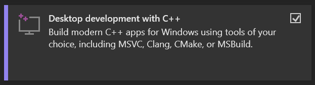
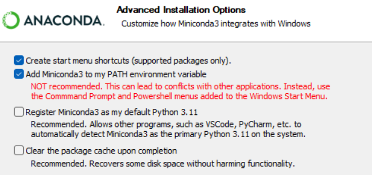
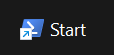
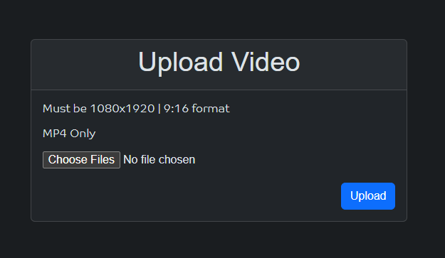
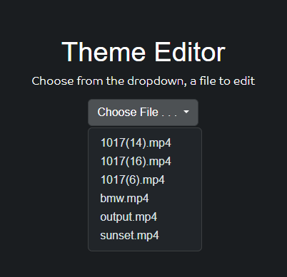
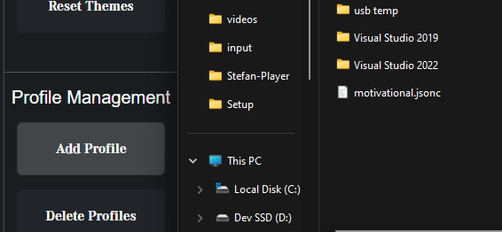

<div id="header">
    <h1 align=center>Stefan Ai</h1>
    <div align="center">
        
    </div>
</div>

### 🔰 What is it about?

Stefan - AI is a state-of-the-art Automated Video Generation Tool which has the goal of automating 90% of your Social Media content creation work and generate profit.

### 🤖 Technologies used:

| -   | Technology                   | Version              | Purpose                                         | Programming<br />language<br />(if applicable) |
| --- | ---------------------------- | -------------------- | ----------------------------------------------- | ---------------------------------------------- |
| 1   | Node.js                      | v20.5.1              | Runtime                                         | JavaScript                                     |
| 2   | Typescript                   | *Latest              | Programming Language                            | TypeScript                                     |
| 3   | WebView2                     | *Latest@11/2023      | GUI Window                                      | C#                                             |
| 4   | MFA                          | 3.0.0 Alpha 8        | Text Aligner                                    | -                                              |
| 5   | VS 2022<br />C++ Dev Package | *Latest              | Compiler for FFmpeg<br />Concat library         | -                                              |
| 6   | FFmpeg                       | Likely 6.0.0         | Processing Videos                               | -                                              |
| 7   | PowerShell                   | Latest on Windows 11 | Development Scripts<br />+<br />Install Scripts | PowerShell                                     |
| 8   | Python                       | 12.0                 | For MFA                                         | -                                              |
| 9   | Miniconda                    | 3                    | For MFA                                         | -                                              |
| 10  | GPT/OpenAI API               | GPT 3.5 Fine Tune    | For Video Script Creation                       | -                                              |
| 11  | Google TTS                   | Latest               | Narration Creation                              | -                                              |
| 12  | BootStrap CSS                | 5                    | UI Creation                                     | CSS                                            |

### ⚙️ Installation

Make sure you have an active internet connection

#### Before installation

Please open a powershell terminal window **as administrator** and run the following command:

```powershell
Set-ExecutionPolicy RemoteSigned
```

#### After PowerShell Command

After the powershell command, navigate to the **"Setup"** folder and run the following scripts:

##### Setup.ps1

Run the python installer, just say yes to everything

For VS 2022, select this and then download

<div>
    
</div>

For miniconda Download, you can click yes for everything, but tick this box:

<div>
    
</div>

Before proceeding with packages.ps1, please restart your terminal and do the following command to see if everything is good:

```shell
conda --version
```

If you get something like `conda v31.221.234`, then its fine. The version won't be that exact one, thats as a demonstration.

##### packages.ps1

Run packages.ps1 in a new terminal and let it complete

##### packages2.ps1

I am not sure if we actually need to run packages2.ps1, but do it just in case, like before, running the .\packages2 file in a new terminal

### 🛫 How to start:

Run this file to start the app



If it does not work, set .ps1 scripts to be opened by default by powershell

2 windows should launch, a terminal window and a GUI. DO not ever close the terminal since the app won't function anymore upon closing that

### 🎥 How to create content:

1. Add videos

   
2. Edit each video's theme:

   
3. Add a video script settings file through

   

Since this app will likely only be ever used by me and maybe my brother, most files like Google JSON, GPT key, video themes file, will come automatically.

To start the production, press the **"Start Production"** button and wait for the app to run.

### ⌚💸 Time it takes to create content

(core i5 6400 used as reference):

On average, it can take between 3 to 10 minutes to create 1 video.

Having a stronger CPU will 100% help it.

App does not rely that much on GPU/Likely not at all


### 💿 Storage

It is reccomended to have at least 20gb of free space. Dependencies + app take up about 10gb - 15gb and each video can take up to 10mb. Average is around 5mb.


Minimum: 20gb free

Reccomended: 30gb free
